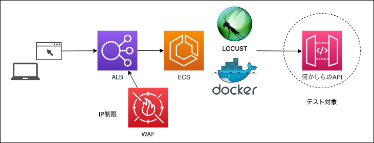
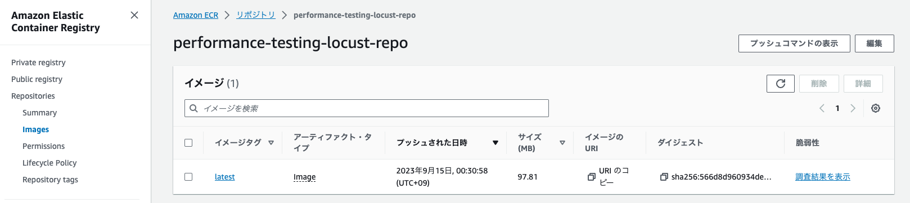
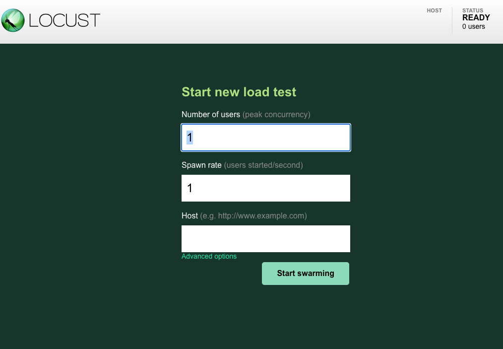

<!-- @import "[TOC]" {cmd="toc" depthFrom=2 depthTo=4 orderedList=false} -->

<!-- code_chunk_output -->

- [システム構成](#システム構成)
- [性能テストの環境構築 & 実行](#性能テストの環境構築--実行)
  - [1. 事前準備](#1-事前準備)
  - [2. デプロイ](#2-デプロイ)
  - [3. テスト実行](#3-テスト実行)
  - [4. 環境削除](#4-環境削除)
- [Locust の開発方法](#locust-の開発方法)
  - [テストシナリオを編集する](#テストシナリオを編集する)
  - [ローカルで動作確認する](#ローカルで動作確認する)
  - [Docker イメージを ECR に push する](#docker-イメージを-ecr-に-push-する)

<!-- /code_chunk_output -->

## システム構成



## 性能テストの環境構築 & 実行

AWS 上に環境構築する。

#### 1. 事前準備

##### ECR

事前準備として、ECR リポジトリを作成する。

`performance-testing-locust-repo` という名前で ECR リポジトリを private で作成する。
リポジトリを作成するだけだとイメージが空なので、「[Docker イメージを ECR に push する](#docker-イメージを-ecr-に-push-する)」を参考に ECR にイメージを push する。



##### WAF

事前に手動で作成する。

##### パラメータの設定

CDK ディレクトリにあるパラメータファイル (parameter.ts) で各種設定をする。

| 項目                  | 値                     |
| --------------------- | ---------------------- |
| envName               | 環境名                 |
| sourceRepository      | Git リポジトリ名       |
| vpc.vpcId             | VPC ID                 |
| vpc.availabilityZones | アベイラビリティゾーン |
| vpc.publicSubnetIds   | public subnet          |
| vpc.privateSubnetIds  | private subnet         |
| loadbalancer.webAclId | WAF web acl            |

#### 2. デプロイ

cdk deploy して AWS に実行環境を構築する。

```sh
git clone git@github.com:takiguchi-yu/locust-boiler-plate.git
cd cdk && npm install
npx aws-cdk deploy --all --require-approval never --profile YOUR-PROFILE
```

> NOTE:
> 10 分くらいはかかります。気長に待ちましょう。

デプロイが終わると ALB の DNS がコンソールに出力されるのでブラウザでアクセスする。

#### 3. テスト実行

実行するユーザー数やレートを調整の上、テストを実行する。



| 項目                                                           | 設定例                  |
| -------------------------------------------------------------- | ----------------------- |
| Number os users（ユーザー数）                                  | 20                      |
| Spawn rate（すべてのユーザーが処理開始するまでのリードタイム） | 1                       |
| Host                                                           | https://api.example.com |

#### 4. 環境削除

テストが終わったらお金がかかるので環境は削除する。

```sh
npx aws-cdk destroy
```

> NOTE:
> 10 分くらいはかかります。気長に待ちましょう。

## Locust の開発方法

### テストシナリオを編集する

シナリオは以下のファイルに編集する。Locust の実装方法は [ドキュメント](https://docs.locust.io/en/stable/what-is-locust.html) を参照。

```sh
app/src/locustfile.py
```

### ローカルで動作確認する

Locust を Docker で実行する。

```sh
docker run -p 8089:8089 -v $PWD:/mnt/locust locustio/locust -f /mnt/locust/locustfile.py
```

ローカルに python が入っていれば以下のコマンドでも実行可能。

```sh
# locust のインストール
pip3 install locust
# 実行
locust -f locustfile.py
```

起動したらブラウザで以下にアクセスする。

- http://0.0.0.0:8089

### Docker イメージを ECR に push する

編集したら Dockerfile を ECR に push する。

```sh
cd app

# 認証トークンを取得し、レジストリに対して Docker クライアントを認証する
aws ecr get-login-password --region ap-northeast-1 --profile YOUR-PROFILE | docker login --username AWS --password-stdin 999999999999.dkr.ecr.ap-northeast-1.amazonaws.com
# Docker イメージを構築する
docker build -t performance-testing-locust-repo .
# 構築が完了したら、リポジトリにイメージをプッシュできるように、イメージにタグを付ける
docker tag performance-testing-locust-repo:latest 999999999999.dkr.ecr.ap-northeast-1.amazonaws.com/performance-testing-locust-repo:latest
# 新しく作成した AWS リポジトリにこのイメージをプッシュする
docker push 999999999999.dkr.ecr.ap-northeast-1.amazonaws.com/performance-testing-locust-repo:latest
```
